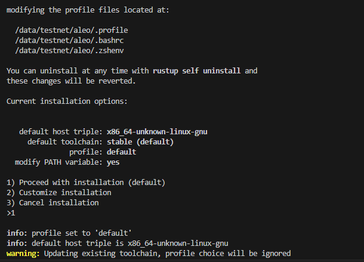

# Aleo developer Toolkit via Gitbash

### What will we need (Preparation) : <a href="#06f3" id="06f3"></a>

1\. Install Git Bash (Follow instructions for Linux\Mac OS or Windows) [LINK](https://git-scm.com/downloads)\
2\. Install Rust’s package manager (Cargo) [LINK](https://www.rust-lang.org/tools/install)\
3\. Visual Studio Code [LINK](https://code.visualstudio.com/?wt.mc\_id=vscom\_downloads)

### 1. Download and install Leo <a href="#8ff7" id="8ff7"></a>

**1.1 Install Rust**

```git
curl --proto '=https' --tlsv1.2 -sSf https://sh.rustup.rs | sh
```

<figure><figcaption></figcaption></figure>

Press **1** and **Enter**

**1.2 Download the source code**

```git
git clone https://github.com/AleoHQ/leo
```

<figure><figcaption></figcaption></figure>

```
cd leo
```

<figure><figcaption></figcaption></figure>

**1.3 Install Leo**

```git
cargo install --path .
```

<figure><figcaption></figcaption></figure>

**1.4 Try writing `leo help` command**

<figure><figcaption></figcaption></figure>

### 2. Working with Leo <a href="#7193" id="7193"></a>

**2.1 Create a new wallet**

```
leo account new
```

or you can import your current wallet

```
leo account import YOUR_Private_Key
```

**2.2 Continue in your exsiting terminal window and type `leo example`**

```
aleo@ruangnode-2:~$ pwd
/data/testnet/aleo
```

**2.3 We’ll try Tic Tac Toe**

```
leo example tictactoe
```

<figure><figcaption></figcaption></figure>

**2.4 You can run and see the example in action**

```
cd tictactoe
```

and run

```
leo run new
```

<figure><figcaption></figcaption></figure>

### 3. Push your Leo app to GitHub <a href="#3118" id="3118"></a>

**3.1 Initializing a Git repository**

```
cd tictactoe

git init -b main

git add .
```

**3.2 Before committing, we need to add your email**

```
  git config --global user.email "you@example.com"
  git config --global user.name "Your Name"
```

Now you can commit

```
git commit -m "First commit"
```

<figure><figcaption></figcaption></figure>

3.4 Adding a local repository to GitHub using Git\
Create a new repository on [GitHub](https://github.com/new)

<figure><figcaption></figcaption></figure>


Type your repository name (you can call it whatever you want) and press Create repository (to avoid errors, do not initialize the new repository with README, license, or gitignore files)


**3.5 Copy the link to your repository**

<figure><figcaption></figcaption></figure>

**3.6 Continue in your existing terminal window and type**

```
git branch -m main

git remote add origin YOUR_REPOSITORY_LINK

git remote -v

git push -u origin main
```

<figure><figcaption></figcaption></figure>

### 4. Congratulations, you can view your repository via your link or in your GitHub profile <a href="#b9a6" id="b9a6"></a>

example : [https://github.com/ruangnode/aleo-tictactoe](https://github.com/ruangnode/aleo-tictactoe)

### 5. Claim your badge <a href="#e0a9" id="e0a9"></a>

5.1 Go to the Leo [repo](https://github.com/AleoHQ/leo/issues)\
Click “New Issue” in the top right corner

<figure><figcaption></figcaption></figure>

Click “Get started” in the Documentation row

<figure><figcaption></figcaption></figure>

`Title your issue: “Add <your_github_username> to contributors” Enter the following as your issue description:`

```
Hi Aleo team! I’m claiming my contributor badge for completing the New Developer Toolkit tutorial.

Tutorial Repo: <GITHUB_REPO_URL>
Requested badge: <BADGE_TYPE>
```

<figure><figcaption></figcaption></figure>

After that you can submit your issue

Once your issue is approved, Aleo team will add you to the [Contributors section](https://github.com/AleoHQ/leo#%EF%B8%8F-contributors) of the Leo README.md file

Congratulations on becoming a Leo contributor!&#x20;

## Continue your Leo journey[​](https://developer.aleo.org/testnet/getting\_started/developer\_toolkit/#continue-your-leo-journey) <a href="#cd09" id="cd09"></a>

Check out the following resources:

* [Aleo developer docs](https://developer.aleo.org/getting\_started/)
* See Aleo’s SDK in action at [aleo.tools](https://aleo.tools/)
* Play around with Leo in the browser with [Leo Playground](https://play.leo-lang.org/)
* Learn Leo syntax, functions, and best practices with the [Leo’s language guide](https://developer.aleo.org/leo/language)
* Deploy and Execute Leo applications on-chain with our [Deploy and Execute Demo](https://developer.aleo.org/testnet/getting\_started/deploy\_execute\_demo)
* See Aleo’s testnet live and other Leo developer’s applications via an explorer such as [Haruka’s Program Registry](https://explorer.hamp.app/programs) or [aleo.network](https://www.aleo.network/)
