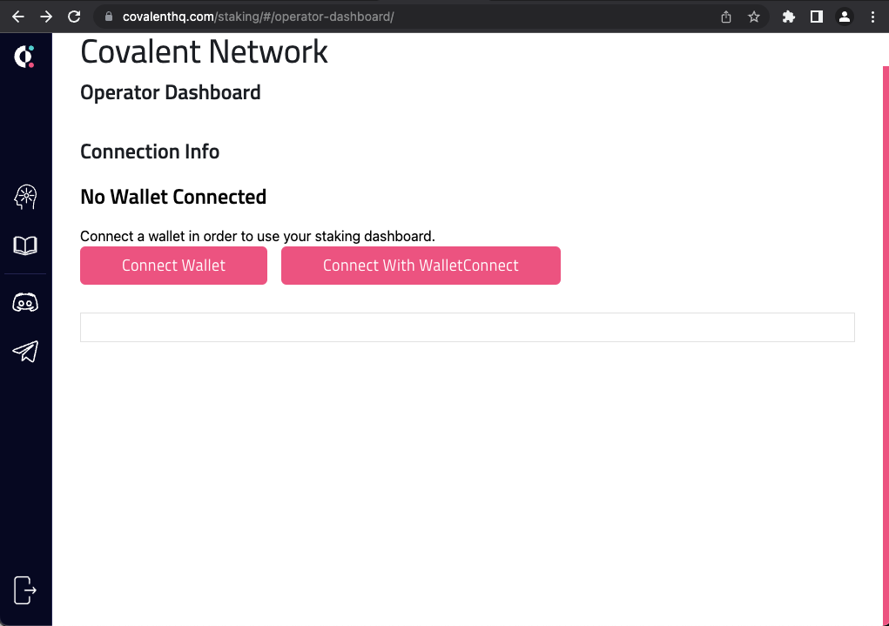
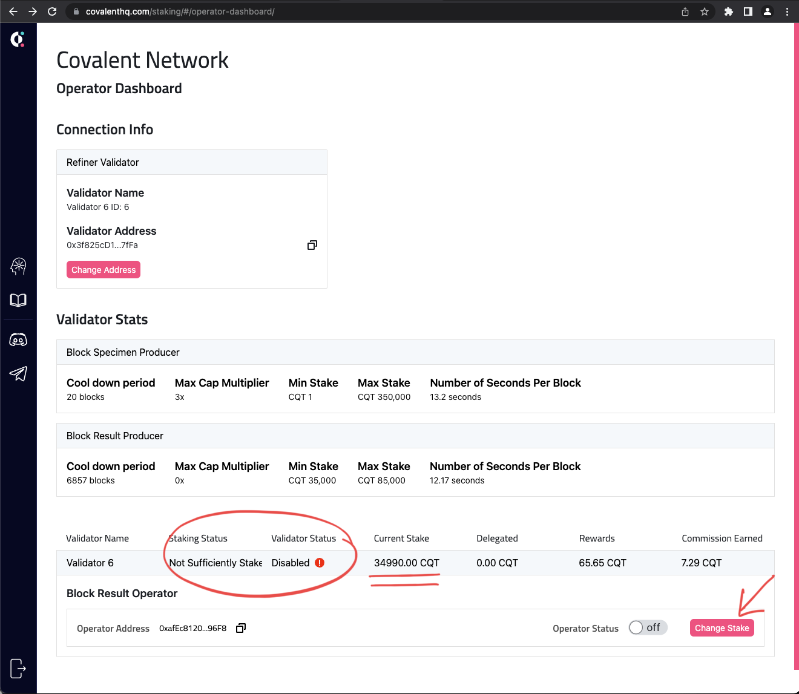
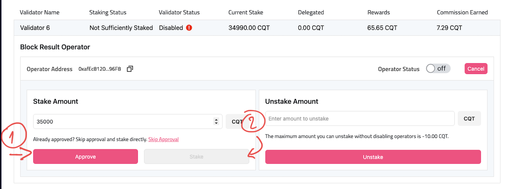

# Validator & Operator Dashboard

1. Access the **Covalent Network Operator Dashboard**. Import your Validator private key into Metamask, select the Moonbase Alpha network (chain\_id: `1287`) and connect your **Validator wallet** to the [operator dashboard](https://www.covalenthq.com/staking/#/operator-dashboard/). Your operator should be currently disabled.

```
Name          : Moonbase Alpha
rpc           : https://rpc.testnet.moonbeam.network
chain         : 1287
Symbol        : DEV
Block explore : https://moonbase.moonscan.io
```


or you can add the rpc to [chainlist](https://chainlist.org/?search=alpha)


<figure><figcaption></figcaption></figure>

<figure><figcaption></figcaption></figure>

2. Self-Stake the Minimum CQT Staking requirement on Moonbase Alpha (35k testnet CQT) for refiner. This is done using the **Change Stake** button in your [operator dashboard](https://www.covalenthq.com/staking/#/operator-dashboard/). Proceed to first set `Stake Amount` to 35000 and click **Approve**.

<figure><figcaption></figcaption></figure>

After the on chain approval transaction completes, click on **Stake**. Once the staking transaction completes, your `Staking Status` should display **Sufficiently Staked**.

3. Then proceed to turn on your `Operator Status` as using the `Operator Status` toggle

<figure><figcaption></figcaption></figure>

4. Please ping us on the discord channel to get values for the environment variable `NODE_ETHEREUM_MAINNET` (needed for `rudder`). These env vars will be used in the setup subsequently.
5. Validators should create a [web3.storage](https://web3.storage) account and a valid API token, update the`WEB3_JWT` (for `ipfs-pinner`) with the API token provided. We don't advice sharing of API tokens.
