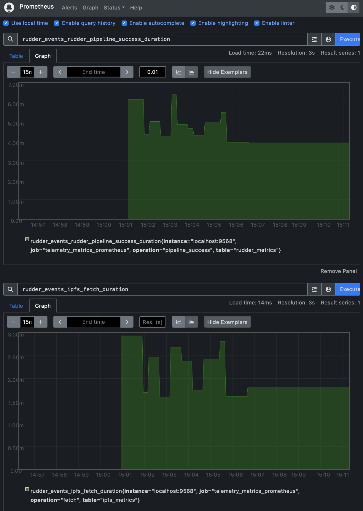

# Grafana & Prometheus Alerting

For installed you can Visit the [LINK](https://docs.ruangnode.com/monitoring/monitoring-stack)

1. Add command to `/etc/prometheus/prometheus.yml`

```
global:
  scrape_interval: 15s

scrape_configs:
  - job_name: "prometheus"
    static_configs:
    - targets: ["localhost:9090"]
  - job_name: "telemetry_metrics_prometheus"
    static_configs:
    - targets: ["localhost:9568"]
```


View exported gauges and counters using prometheus at the endpoint -> [http://localhost:9568/metrics](http://localhost:9568/metrics)


Observe live the gauge time series graphs with plots for example with metrics for `pipeline_success` and `ipfs_fetch` -> [http://localhost:9090/graph?g0.expr=rudder\_events\_rudder\_pipeline\_success\_duration\&g0.tab=0\&g0.stacked=1\&g0.show\_exemplars=0\&g0.range\_input=15m\&g0.step\_input=1\&g1.expr=rudder\_events\_ipfs\_fetch\_duration\&g1.tab=0\&g1.stacked=1\&g1.show\_exemplars=1\&g1.range\_input=15m\&g1.step\_input=1](http://localhost:9090/graph?g0.expr=rudder\_events\_rudder\_pipeline\_success\_duration\&g0.tab=0\&g0.stacked=1\&g0.show\_exemplars=0\&g0.range\_input=15m\&g0.step\_input=1\&g1.expr=rudder\_events\_ipfs\_fetch\_duration\&g1.tab=0\&g1.stacked=1\&g1.show\_exemplars=1\&g1.range\_input=15m\&g1.step\_input=1)

<figure><figcaption></figcaption></figure>

### Monitor & Alert

1. Import grafa\_rudder\_dashboard.json

```json
{
    "__inputs": [{
        "name": "DS_PROMETHEUS",
        "label": "Prometheus",
        "description": "",
        "type": "datasource",
        "pluginId": "prometheus",
        "pluginName": "Prometheus"
    }],
    "__elements": {},
    "__requires": [{
            "type": "grafana",
            "id": "grafana",
            "name": "Grafana",
            "version": "9.4.7"
        },
        {
            "type": "datasource",
            "id": "prometheus",
            "name": "Prometheus",
            "version": "1.0.0"
        },
        {
            "type": "panel",
            "id": "stat",
            "name": "Stat",
            "version": ""
        },
        {
            "type": "panel",
            "id": "timeseries",
            "name": "Time series",
            "version": ""
        }
    ],
    "annotations": {
        "list": [{
            "builtIn": 1,
            "datasource": {
                "type": "grafana",
                "uid": "-- Grafana --"
            },
            "enable": true,
            "hide": true,
            "iconColor": "rgba(0, 211, 255, 1)",
            "name": "Annotations & Alerts",
            "target": {
                "limit": 100,
                "matchAny": false,
                "tags": [],
                "type": "dashboard"
            },
            "type": "dashboard"
        }]
    },
    "editable": true,
    "fiscalYearStartMonth": 0,
    "graphTooltip": 0,
    "id": null,
    "links": [],
    "liveNow": false,
    "panels": [{
            "datasource": {
                "type": "prometheus",
                "uid": "${DS_PROMETHEUS}"
            },
            "fieldConfig": {
                "defaults": {
                    "color": {
                        "mode": "thresholds"
                    },
                    "mappings": [],
                    "thresholds": {
                        "mode": "absolute",
                        "steps": [{
                                "color": "green",
                                "value": null
                            },
                            {
                                "color": "red",
                                "value": 80
                            }
                        ]
                    }
                },
                "overrides": []
            },
            "gridPos": {
                "h": 7,
                "w": 5,
                "x": 0,
                "y": 0
            },
            "id": 6,
            "options": {
                "colorMode": "value",
                "graphMode": "area",
                "justifyMode": "auto",
                "orientation": "auto",
                "reduceOptions": {
                    "calcs": [
                        "lastNotNull"
                    ],
                    "fields": "",
                    "values": false
                },
                "textMode": "auto"
            },
            "pluginVersion": "9.4.7",
            "targets": [{
                "datasource": {
                    "type": "prometheus",
                    "uid": "${DS_PROMETHEUS}"
                },
                "editorMode": "builder",
                "expr": "rudder_events_brp_upload_success_count",
                "legendFormat": "__auto",
                "range": true,
                "refId": "A"
            }],
            "title": "Block Result Uploads",
            "type": "stat"
        },
        {
            "datasource": {
                "type": "prometheus",
                "uid": "${DS_PROMETHEUS}"
            },
            "fieldConfig": {
                "defaults": {
                    "color": {
                        "mode": "thresholds"
                    },
                    "mappings": [],
                    "thresholds": {
                        "mode": "absolute",
                        "steps": [{
                                "color": "green",
                                "value": null
                            },
                            {
                                "color": "red",
                                "value": 80
                            }
                        ]
                    }
                },
                "overrides": []
            },
            "gridPos": {
                "h": 7,
                "w": 5,
                "x": 5,
                "y": 0
            },
            "id": 8,
            "options": {
                "colorMode": "value",
                "graphMode": "area",
                "justifyMode": "auto",
                "orientation": "auto",
                "reduceOptions": {
                    "calcs": [
                        "lastNotNull"
                    ],
                    "fields": "",
                    "values": false
                },
                "textMode": "auto"
            },
            "pluginVersion": "9.4.7",
            "targets": [{
                "datasource": {
                    "type": "prometheus",
                    "uid": "${DS_PROMETHEUS}"
                },
                "editorMode": "builder",
                "expr": "rudder_events_rudder_pipeline_success_count",
                "legendFormat": "__auto",
                "range": true,
                "refId": "A"
            }],
            "title": "Pipeline Success",
            "type": "stat"
        },
        {
            "datasource": {
                "type": "prometheus",
                "uid": "${DS_PROMETHEUS}"
            },
            "fieldConfig": {
                "defaults": {
                    "color": {
                        "mode": "thresholds"
                    },
                    "mappings": [],
                    "min": 0,
                    "thresholds": {
                        "mode": "absolute",
                        "steps": [{
                                "color": "green",
                                "value": null
                            },
                            {
                                "color": "red",
                                "value": 80
                            }
                        ]
                    },
                    "unit": "none"
                },
                "overrides": []
            },
            "gridPos": {
                "h": 7,
                "w": 5,
                "x": 10,
                "y": 0
            },
            "id": 10,
            "options": {
                "colorMode": "value",
                "graphMode": "area",
                "justifyMode": "auto",
                "orientation": "auto",
                "reduceOptions": {
                    "calcs": [],
                    "fields": "",
                    "values": false
                },
                "textMode": "auto"
            },
            "pluginVersion": "9.4.7",
            "targets": [{
                "datasource": {
                    "type": "prometheus",
                    "uid": "${DS_PROMETHEUS}"
                },
                "editorMode": "builder",
                "expr": "rudder_events_rudder_pipeline_failure_count",
                "legendFormat": "__auto",
                "range": true,
                "refId": "A"
            }],
            "title": "Pipeline Failure",
            "type": "stat"
        },
        {
            "datasource": {
                "type": "prometheus",
                "uid": "${DS_PROMETHEUS}"
            },
            "fieldConfig": {
                "defaults": {
                    "color": {
                        "mode": "palette-classic"
                    },
                    "custom": {
                        "axisCenteredZero": false,
                        "axisColorMode": "text",
                        "axisLabel": "",
                        "axisPlacement": "auto",
                        "barAlignment": 0,
                        "drawStyle": "bars",
                        "fillOpacity": 0,
                        "gradientMode": "none",
                        "hideFrom": {
                            "legend": false,
                            "tooltip": false,
                            "viz": false
                        },
                        "lineInterpolation": "linear",
                        "lineStyle": {
                            "fill": "solid"
                        },
                        "lineWidth": 1,
                        "pointSize": 5,
                        "scaleDistribution": {
                            "type": "linear"
                        },
                        "showPoints": "always",
                        "spanNulls": false,
                        "stacking": {
                            "group": "A",
                            "mode": "none"
                        },
                        "thresholdsStyle": {
                            "mode": "off"
                        }
                    },
                    "mappings": [],
                    "thresholds": {
                        "mode": "absolute",
                        "steps": [{
                                "color": "green",
                                "value": null
                            },
                            {
                                "color": "red",
                                "value": 80
                            }
                        ]
                    },
                    "unit": "none"
                },
                "overrides": []
            },
            "gridPos": {
                "h": 15,
                "w": 19,
                "x": 0,
                "y": 7
            },
            "id": 4,
            "options": {
                "legend": {
                    "calcs": [
                        "count"
                    ],
                    "displayMode": "table",
                    "placement": "bottom",
                    "showLegend": true
                },
                "tooltip": {
                    "mode": "single",
                    "sort": "none"
                }
            },
            "pluginVersion": "9.4.7",
            "targets": [{
                    "datasource": {
                        "type": "prometheus",
                        "uid": "${DS_PROMETHEUS}"
                    },
                    "editorMode": "builder",
                    "expr": "rudder_events_rudder_pipeline_success_count",
                    "legendFormat": "__auto",
                    "range": true,
                    "refId": "A"
                },
                {
                    "datasource": {
                        "type": "prometheus",
                        "uid": "${DS_PROMETHEUS}"
                    },
                    "editorMode": "builder",
                    "expr": "rudder_events_ipfs_fetch_count",
                    "hide": false,
                    "legendFormat": "__auto",
                    "range": true,
                    "refId": "B"
                },
                {
                    "datasource": {
                        "type": "prometheus",
                        "uid": "${DS_PROMETHEUS}"
                    },
                    "editorMode": "builder",
                    "expr": "rudder_events_brp_upload_success_count",
                    "hide": false,
                    "legendFormat": "__auto",
                    "range": true,
                    "refId": "C"
                }
            ],
            "title": "Rudder Events Success Count",
            "type": "timeseries"
        },
        {
            "datasource": {
                "type": "prometheus",
                "uid": "${DS_PROMETHEUS}"
            },
            "fieldConfig": {
                "defaults": {
                    "color": {
                        "mode": "palette-classic"
                    },
                    "custom": {
                        "axisCenteredZero": false,
                        "axisColorMode": "series",
                        "axisGridShow": true,
                        "axisLabel": "",
                        "axisPlacement": "auto",
                        "barAlignment": 0,
                        "drawStyle": "line",
                        "fillOpacity": 0,
                        "gradientMode": "none",
                        "hideFrom": {
                            "legend": false,
                            "tooltip": false,
                            "viz": false
                        },
                        "lineInterpolation": "linear",
                        "lineWidth": 2,
                        "pointSize": 5,
                        "scaleDistribution": {
                            "type": "linear"
                        },
                        "showPoints": "auto",
                        "spanNulls": false,
                        "stacking": {
                            "group": "A",
                            "mode": "none"
                        },
                        "thresholdsStyle": {
                            "mode": "off"
                        }
                    },
                    "mappings": [],
                    "thresholds": {
                        "mode": "absolute",
                        "steps": [{
                                "color": "green",
                                "value": null
                            },
                            {
                                "color": "red",
                                "value": 80
                            }
                        ]
                    }
                },
                "overrides": []
            },
            "gridPos": {
                "h": 15,
                "w": 21,
                "x": 0,
                "y": 22
            },
            "id": 2,
            "options": {
                "legend": {
                    "calcs": [
                        "mean",
                        "count",
                        "range",
                        "sum"
                    ],
                    "displayMode": "table",
                    "placement": "bottom",
                    "showLegend": true
                },
                "timezone": [
                    "browser"
                ],
                "tooltip": {
                    "mode": "single",
                    "sort": "none"
                }
            },
            "targets": [{
                    "datasource": {
                        "type": "prometheus",
                        "uid": "${DS_PROMETHEUS}"
                    },
                    "editorMode": "builder",
                    "expr": "rudder_events_rudder_pipeline_success_duration",
                    "legendFormat": "__auto",
                    "range": true,
                    "refId": "A"
                },
                {
                    "datasource": {
                        "type": "prometheus",
                        "uid": "${DS_PROMETHEUS}"
                    },
                    "editorMode": "builder",
                    "expr": "rudder_events_brp_proof_duration",
                    "hide": false,
                    "legendFormat": "__auto",
                    "range": true,
                    "refId": "B"
                },
                {
                    "datasource": {
                        "type": "prometheus",
                        "uid": "${DS_PROMETHEUS}"
                    },
                    "editorMode": "builder",
                    "expr": "rudder_events_ipfs_fetch_duration",
                    "hide": false,
                    "legendFormat": "__auto",
                    "range": true,
                    "refId": "C"
                }
            ],
            "title": "Rudder Pipeline Event Durations",
            "type": "timeseries"
        }
    ],
    "refresh": "30m",
    "revision": 1,
    "schemaVersion": 38,
    "style": "dark",
    "tags": [],
    "templating": {
        "list": []
    },
    "time": {
        "from": "now-2d",
        "to": "now"
    },
    "timepicker": {},
    "timezone": "",
    "title": "Rudder Dashboard",
    "uid": "poakTV8Vz",
    "version": 7,
    "weekStart": ""
}
```

<figure><figcaption></figcaption></figure>

<figure><figcaption></figcaption></figure>
